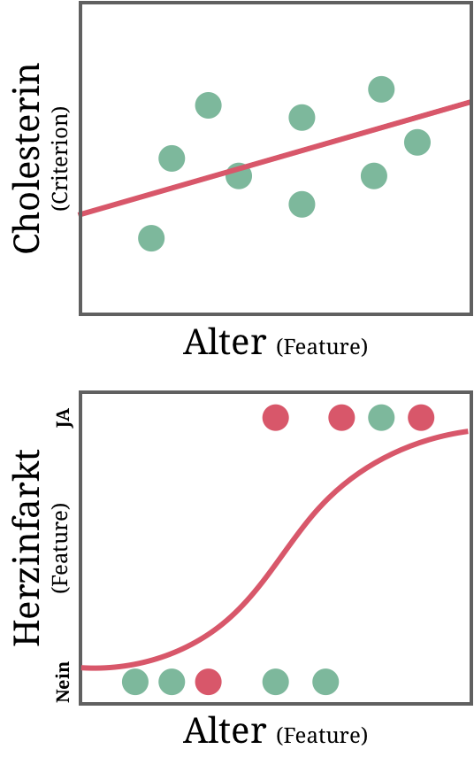

layout: true

<div class="my-footer">
  <span style="text-align:center">
    <span> 
      
    </span>
    <a href="https://therbootcamp.github.io/">
      <span style="padding-left:82px"> 
        <font color="#7E7E7E">
          www.therbootcamp.com
        </font>
      </span>
    </a>
    <a href="https://therbootcamp.github.io/">
      <font color="#7E7E7E">
       Machine Learning with R | October 2019
      </font>
    </a>
    </span>
  </div> 

---


```{r setup, include=FALSE}
options(htmltools.dir.version = FALSE)
# see: https://github.com/yihui/xaringan
# install.packages("xaringan")
# see: 
# https://github.com/yihui/xaringan/wiki
# https://github.com/gnab/remark/wiki/Markdown
options(width=110)
options(digits = 4)

# Get color palette functions

source("https://raw.githubusercontent.com/therbootcamp/ML_2019Oct/master/_materials/code/baselrbootcamp_palettes.R")
```


```{r, echo = FALSE ,message = FALSE, warning = FALSE}

knitr::opts_chunk$set(comment=NA, fig.width=6, fig.height=6, echo = TRUE, eval = TRUE, 
                      message = FALSE, warning = FALSE, fig.align = 'center', dpi = 200)
library(tidyverse)
library(ggthemes)
library(ggpubr)
library(caret)
library(ISLR)

baselers <- read_csv("1_Data/baselers.csv")

set.seed(102)
x <- rnorm(10)
y <- .7 * x + rnorm(10, sd = .3) + 2

data <- data.frame(x, y)

mod <- lm(y ~ x, data = data)

great_intercept <- mod$coefficients[1]
great_slope <- mod$coefficients[2]

bad_intercept <- 3.5
bad_slope <- -.5

x0 = x
x1 = x
y0 = y
y1 = great_intercept + great_slope * x

yhat_regression  = y1

dat_great <- data.frame(x0, x1, y0, y1)

x0 = x
x1 = x
y0 = y
y1 = bad_intercept + bad_slope * x

dat_bad <- data.frame(x0, x1, y0, y1)

library(tidyverse)

raw <- ggplot(dat_great, aes(x = x0, y = y0)) + geom_point(col = baselrbootcamp_cols("grey"), size = 2) +
  theme_minimal() +
  xlim(c(-2, 3)) +
  ylim(c(0, 5)) +
  labs(title = "Raw Data", 
       x = "Feature", y = "Criterion")

great_raw <- ggplot(dat_great, aes(x = x0, y = y0)) + geom_point(col = baselrbootcamp_cols("grey"), size = 2) +
  geom_abline(slope = great_slope, intercept = great_intercept, size = .5, linetype = 3) +
  theme_minimal() +
  xlim(c(-2, 3)) +
  ylim(c(0, 5)) +
  labs(title = "Model B", 
              subtitle = paste0("B0 = ", round(great_intercept, 2), ", B1 = ", round(great_slope, 2)),

       x = "Feature", y = "Criterion")

bad_raw <- ggplot(dat_bad, aes(x = x0, y = y0)) + geom_point(col = baselrbootcamp_cols("grey")) +
  geom_abline(slope = bad_slope, intercept = bad_intercept, size = .5, linetype = 3) +
  theme_minimal() +
  xlim(c(-2, 3)) +
  ylim(c(0, 5)) +
   labs(title = "Model A", 
        subtitle = paste0("B0 = ", round(bad_intercept, 2), ", B1 = ", round(bad_slope, 2)),
       x = "Feature", y = "Criterion")

great_err <- great_raw + 
  geom_linerange(data = dat_great, aes(x = x0, ymin = y0, ymax = y1), col = baselrbootcamp_cols("magenta")) +
  geom_point(data = dat_great, aes(x = x0, y = y1, size = 2), col = baselrbootcamp_cols("green"), pch = "X", size = 4) +
    labs(title = "Model B",
       x = "Feature", y = "Criterion")

bad_err <- bad_raw +
    geom_linerange(data = dat_bad, aes(x = x0, ymin = y0, ymax = y1), col = baselrbootcamp_cols("magenta")) +
    geom_point(data = dat_bad, aes(x = x0, y = y1, size = 2), col = baselrbootcamp_cols("green"), pch = "X", size = 4) +
   labs(title = "Model A",
       x = "Feature", y = "Criterion")


set.seed(103)
x <- rnorm(10)
y <- round(1 / (1 + exp(rnorm(10,0,1)+x-1)))

data <- data.frame(x, y)
mod <- glm(y ~ x, data = data, family='binomial')

great_intercept <- mod$coefficients[1]
great_slope <- mod$coefficients[2]

x0 = x
x1 = x
y0 = y
y1 = 1/(1+exp(-(great_intercept + great_slope * x)))

dat_great <- data.frame(x0, x1, y0, y1)


logreg1 = ggplot(dat_great, aes(x = x0, y = y0)) + geom_point(col = baselrbootcamp_cols("grey"), size = 2) +
  theme_minimal() +
  labs(x = "Feature", y = "Criterion")

logreg2 = logreg1 + 
  geom_line(aes(x0,y1), size = .5, linetype = 3) +
  geom_linerange(data = dat_great, aes(x = x0, ymin = y0, ymax = y1), col = baselrbootcamp_cols("magenta")) +
  geom_point(data = dat_great, aes(x = x0, y = y1, size = 2), col = baselrbootcamp_cols("green"), pch = "X", size = 4) 

```


.pull-left45[

# Fitting

<p style="padding-top:1px"></p>

Models are actually <high>families of models</high>, with every parameter combination specifying a different model. 

To fit a model means to <high>identify</high> from the family of models <high>the specific model that fits the data best</high>. 

]

.pull-right45[

<br><br>

<p align = "center">
<br>
<font style="font-size:10px">adapted from <a href="https://www.explainxkcd.com/wiki/index.php/2048:_Curve-Fitting">explainxkcd.com</a></font>
</p>

]

---

# Which of these models is better? Why?

```{r, echo = FALSE, fig.width = 6, fig.height = 3, dpi = 300, out.width = "90%"}
ggarrange(bad_raw, great_raw, ncol = 2, nrow = 1)
```


---

# Which of these models is better? Why?

```{r, echo = FALSE, fig.width = 6, fig.height = 3, dpi = 300, out.width = "90%"}
ggarrange(bad_err, great_err, ncol = 2, nrow = 1)
```


---

# Loss function

.pull-left45[

Possible <high>the most important concept</high> in statistics and machine learning.

The loss function defines some <high>summary of the errors committed by the model</high>.

<p style="padding-top:7px">

$$\Large Loss = f(Error)$$

<p style="padding-top:7px">

<u>Two purposes</u>

<table style="cellspacing:0; cellpadding:0; border:none;">
<tr>
  <td>
    <b>Purpose</b>
  </td>
  <td>
    <b>Description</b>
  </td>
</tr>
<tr>
  <td bgcolor="white">
    Fitting
  </td>
  <td bgcolor="white">
    Find parameters that minimize loss function.
  </td>
</tr>
<tr>
  <td>
    Evaluation
  </td>
  <td>
    Calculate loss function for fitted model.
  </td>
</tr>
</table>

]


.pull-right45[

```{r, echo = FALSE, fig.width = 3, fig.height = 3, dpi = 200, out.width = "90%"}
bad_err + labs(title=element_blank(),subtitle = element_blank())
```


]

---

class: center, middle

<high><h1>Regression</h1></high>

<font color = "gray"><h1>Decision Trees</h1></font>

<font color = "gray"><h1>Random Forests</h1></font>


---

# Regression

.pull-left45[

In [regression](https://en.wikipedia.org/wiki/Regression_analysis), the criterion $Y$ is modeled as the <high>sum</high> of <high>features</high> $X_1, X_2, ...$ <high>times weights</high> $\beta_1, \beta_2, ...$ plus $\beta_0$ the so-called the intercept.

<p style="padding-top:10px"></p>


$$\large \hat{Y} =  \beta_{0} + \beta_{1} \times X_1 + \beta_{2} \times X2 + ...$$

<p style="padding-top:10px"></p>

The weight $\beta_{i}$ indiciates the <high>amount of change</high> in $\hat{Y}$ for a change of 1 in $X_{i}$.

Ceteris paribus, the <high>more extreme</high> $\beta_{i}$, the <high>more important</high> $X_{i}$ for the prediction of $Y$ <font style="font-size:12px">(Note: the scale of $X_{i}$ matters too!).</font>

If $\beta_{i} = 0$, then $X_{i}$ <high>does not help</high> predicting $Y$


]

.pull-right45[

```{r, echo = FALSE, fig.width = 3, fig.height = 3, dpi = 200, out.width = "90%"}
bad_err + labs(title=element_blank(),subtitle = element_blank())
```


]

---

# Regression

.pull-left45[

In [regression](https://en.wikipedia.org/wiki/Regression_analysis), the criterion $Y$ is modeled as the <high>sum</high> of <high>features</high> $X_1, X_2, ...$ <high>times weights</high> $\beta_1, \beta_2, ...$ plus $\beta_0$ the so-called the intercept.

<p style="padding-top:10px"></p>


$$\large \hat{Y} =  \beta_{0} + \beta_{1} \times X_1 + \beta_{2} \times X2 + ...$$

<p style="padding-top:10px"></p>

The weight $\beta_{i}$ indiciates the <high>amount of change</high> in $\hat{Y}$ for a change of 1 in $X_{i}$.

Ceteris paribus, the <high>more extreme</high> $\beta_{i}$, the <high>more important</high> $X_{i}$ for the prediction of $Y$ <font style="font-size:12px">(Note: the scale of $X_{i}$ matters too!).</font>

If $\beta_{i} = 0$, then $X_{i}$ <high>does not help</high> predicting $Y$


]

.pull-right45[

<p align = "center">
<br>
</p>

<p style="padding-top:10px"></p>

$$
\large
\begin{split}
\hat{Y} = & 3.88 + \\
&.015 * CompPrice + \\
& .014 * Income + \\
& .111 * Advertising \\
\end{split}
$$

<div style="padding-left:50px">
$$$$
</p>


]


---

# Regression loss

.pull-left45[

<p>

<font style="font-size:24"><b> Mean Squared Error (MSE)</b></font><br><br><high>Average squared distance</high> between predictions and true values?<br>

$$ MSE = \frac{1}{n}\sum_{i \in 1,...,n}(Y_{i} - \hat{Y}_{i})^{2}$$

<br><font style="font-size:24"><b> Mean Absolute Error (MAE)</b></font><br><br><high>Average absolute distance</high> between predictions and true values?<br>

$$ MAE = \frac{1}{n}\sum_{i \in 1,...,n} \lvert Y_{i} - \hat{Y}_{i} \rvert$$


</p>

]

.pull-right45[

```{r, echo = FALSE, fig.width = 3, fig.height = 3, dpi = 200, out.width = "90%"}
bad_err + labs(title=element_blank(),subtitle = element_blank())

```


]


---

# Fitting

.pull-left45[

There are two fundamentally different ways to find the set of parameters that minimizes loss.

<font style="font-size:24"><b> Analytically </b>

In rare cases, the parameters can be <high>directly calculated</high>, e.g., using the <i>normal equation</i>: 

$$\boldsymbol \beta = (\boldsymbol X^T\boldsymbol X)^{-1}\boldsymbol X^T\boldsymbol y$$

<font style="font-size:24"><b> Numerically </b>

In most cases, parameters need to be found using a <high>directed trial and error</high>, e.g., <i>gradient descent</i>: 

$$\boldsymbol \beta_{n+1} = \boldsymbol \beta_{n}+\gamma \nabla F(\boldsymbol \beta_{n})$$

]

.pull-right45[

<p align = "center">
<br>
<font style="font-size:10px">adapted from <a href="https://me.me/i/machine-learning-gradient-descent-machine-learning-machine-learning-behind-the-ea8fe9fc64054eda89232d7ffc9ba60e">me.me</a></font>
</p>

]


---

.pull-left45[

# Fitting

<p style="padding-top:1px"></p>

There are two fundamentally different ways to find the set of parameters that minimizes loss.

<font style="font-size:24"><b> Analytically </b>

In rare cases, the parameters can be <high>directly calculated</high>, e.g., using the <i>normal equation</i>: 

$$\boldsymbol \beta = (\boldsymbol X^T\boldsymbol X)^{-1}\boldsymbol X^T\boldsymbol y$$

<font style="font-size:24"><b> Numerically </b>

In most cases, parameters need to be found using a <high>directed trial and error</high>, e.g., <i>gradient descent</i>: 

$$\boldsymbol \beta_{n+1} = \boldsymbol \beta_{n}+\gamma \nabla F(\boldsymbol \beta_{n})$$


]

.pull-right45[

<br><br2>

<p align = "center">
<br>
<font style="font-size:10px">adapted from <a href="https://dunglai.github.io/2017/12/21/gradient-descent/
">dunglai.github.io</a></font><br>
<br>
<font style="font-size:10px">adapted from <a href="https://dunglai.github.io/2017/12/21/gradient-descent/
">dunglai.github.io</a></font>
</p>

]

---

# 2 types of supervised problems

.pull-left5[

There are two types of supervised learning problems that can often be approached using the same model.

<font style="font-size:24px"><b>Regression</b></font>

Regression problems involve the <high>prediction of a quantitative feature</high>. 

E.g., predicting the cholesterol level as a function of age. 

<font style="font-size:24px"><b>Classification</b></font>

Classification problems involve the <high>prediction of a categorical feature</high>.   

E.g., predicting the type of chest pain as a function of age. 


]

.pull-right4[

<p align = "center">
<br>
</p>

]

---

# Logistic regression

.pull-left45[

In [logistic regression](https://en.wikipedia.org/wiki/Logistic_regression), the class criterion $Y \in (0,1)$ is modeled also as the <high>sum of feature times weights</high>, but with the prediction being transformed using a <high>logistic link function</high>:

<p style="padding-top:10px"></p>

$$\large \hat{Y} =  Logistic(\beta_{0} + \beta_{1} \times X_1 + ...)$$

<p style="padding-top:10px"></p>

The logistic function <high>maps predictions to the range of 0 and 1</high>, the two class values.

<p style="padding-top:10px"></p>

$$ Logistic(x) = \frac{1}{1+exp(-x)}$$

]

.pull-right45[

```{r, echo = FALSE, fig.width = 3, fig.height = 3, dpi = 200, out.width = "90%"}
logreg1
```

]

---

# Logistic regression

.pull-left45[

In [logistic regression](https://en.wikipedia.org/wiki/Logistic_regression), the class criterion $Y \in (0,1)$ is modeled also as the <high>sum of feature times weights</high>, but with the prediction being transformed using a <high>logistic link function</high>:

<p style="padding-top:10px"></p>

$$\large \hat{Y} =  Logistic(\beta_{0} + \beta_{1} \times X_1 + ...)$$

<p style="padding-top:10px"></p>

The logistic function <high>maps predictions to the range of 0 and 1</high>, the two class values.

<p style="padding-top:10px"></p>

$$ Logistic(x) = \frac{1}{1+exp(-x)}$$

]

.pull-right45[

```{r, echo = FALSE, fig.width = 3, fig.height = 3, dpi = 200, out.width = "90%"}
logreg2
```

]

---

# Classification loss - two ways

.pull-left45[

<font style="font-size:24px"><b>Distance</b></font>

Logloss is <high>used to fit the parameters</high>, alternative distance measures are MSE and MAE.

$$\small LogLoss = -\frac{1}{n}\sum_{i}^{n}(log(\hat{y})y+log(1-\hat{y})(1-y))$$
$$\small MSE = \frac{1}{n}\sum_{i}^{n}(y-\hat{y})^2, \: MAE = \frac{1}{n}\sum_{i}^{n} \lvert y-\hat{y} \rvert$$

<font style="font-size:24px"><b>Overlap</b></font>

Does the <high>predicted class match the actual class</high>. Often preferred for <high>ease of interpretation</high>. 

$$\small Loss_{01}=\frac{1}{n}\sum_i^n I(y \neq \lfloor \hat{y} \rceil)$$

]

.pull-right45[

```{r, echo = FALSE, fig.width = 3, fig.height = 3, dpi = 200, out.width = "90%"}
logreg2
```

]

---

# Confusion matrix

.pull-left45[

The confusion matrix <high>tabulates prediction matches and mismatches</high> as a function of the true class.

The confusion matrix permits specification of a number of <high>helpful performance metrics</high>.  

<br>

<u> Confusion matrix </u>

<table style="cellspacing:0; cellpadding:0; border:none;">
<tr>
  <td>
  </td>
  <td>
    <eq><b>y&#770; = 1</b></eq>
  </td>
  <td>
    <eq><b>y&#770; = 0</b></eq>
  </td>
</tr>
<tr>
  <td bgcolor="white">
    <eq><b>y = 1</b></eq>
  </td>
  <td bgcolor="white">
    <font color="#6ABA9A"> True positive (TP)</font>
  </td>
  <td bgcolor="white">
    <font color="#EA4B68"> False negative (FN)</font>
  </td>
</tr>
<tr>
  <td>
    <eq><b>y = 0</b></eq>
  </td>
  <td>
    <font color="#EA4B68"> False positive (FP)</font>
  </td>
  <td>
    <font color="#6ABA9A"> True negative (TN)</font>
  </td>
</tr>
</table>


]

.pull-right45[


<b>Accuracy</b>: Of all cases</i>, what percent of predictions are correct?

$$\small Acc. = \frac{TP + TN}{ TP + TN + FN + FP} = 1-Loss_{01}$$

<p style="padding-top:10px"></p>

<b>Sensitivity</b>: Of the truly Positive cases</i>, what percent of predictions are correct?

$$\small Sensitivity = \frac{TP}{ TP +FN }$$

<b>Specificity</b>: Of the truly Negative cases</i>, what percent of predictions are correct?

<p style="padding-top:10px"></p>

$$\small Specificity = \frac{TN}{ TN + FP }$$

]


---

# Confusion matrix

.pull-left45[

The confusion matrix <high>tabulates prediction matches and mismatches</high> as a function of the true class.

The confusion matrix permits specification of a number of <high>helpful performance metrics</high>.  

<br>

<u> Confusion matrix </u>

<table style="cellspacing:0; cellpadding:0; border:none;">
<tr>
  <td>
  </td>
  <td>
    <eq><b>"Default"</b></eq>
  </td>
  <td>
    <eq><b>"Repay"</b></eq>
  </td>
</tr>
<tr>
  <td bgcolor="white">
    <eq><b>Default</b></eq>
  </td>
  <td bgcolor="white">
    <font color="#6ABA9A"> TP = 3</font>
  </td>
  <td bgcolor="white">
    <font color="#EA4B68"> FN = 1</font>
  </td>
</tr>
<tr>
  <td>
    <eq><b>Repay</b></eq>
  </td>
  <td>
    <font color="#EA4B68"> FP = 1</font>
  </td>
  <td>
    <font color="#6ABA9A"> TN = 2</font>
  </td>
</tr>
</table>


]

.pull-right45[


<b>Accuracy</b>: Of all cases</i>, what percent of predictions are correct?

$$\small Acc. = \frac{TP + TN}{ TP + TN + FN + FP} = 1-Loss_{01}$$

<p style="padding-top:10px"></p>

<b>Sensitivity</b>: Of the truly Positive cases</i>, what percent of predictions are correct?

$$\small Sensitivity = \frac{TP}{ TP +FN }$$

<b>Specificity</b>: Of the truly Negative cases</i>, what percent of predictions are correct?

<p style="padding-top:10px"></p>

$$\small Specificity = \frac{TN}{ TN + FP }$$

]


---
class: center,  middle

<br><br>

# Let's fit regression models with `caret`!

```{r, echo = FALSE, out.width = "70%"}
knitr::include_graphics("https://3qeqpr26caki16dnhd19sv6by6v-wpengine.netdna-ssl.com/wp-content/uploads/2014/09/Caret-package-in-R.png")
```


```{r, echo = FALSE}
library(caret)
data(cars)
```


---

# `caret`

.pull-left45[

<u><mono>caret</mono>'s key fitting functions</u>

<table style="cellspacing:0; cellpadding:0; border:none;">
<tr>
  <td>
  <b>Function</b>
  </td>
  <td>
    <b>Description</b>
  </td>
</tr>
<tr>
  <td bgcolor="white">
    <mono>trainControl()</mono>
  </td>
  <td bgcolor="white">
    Choose settings for how fitting should be carried out.
  </td>
</tr>
<tr>
  <td>
    <mono>train()</mono>
  </td>
  <td>
    Specify the model and find *best* parameters.
  </td>
</tr>
<tr>
  <td bgcolor="white">
    <mono>postResample()</mono>
  </td>
  <td bgcolor="white">
    Evaluate model performance (fitting or prediction) for regression.
  </td>
</tr>
<tr>
  <td>
    <mono>confusionMatrix()</mono>
  </td>
  <td bgcolor="white">
    Evaluate model performance (fitting or prediction) for classification.
  </td>
</tr>
</table>

]

.pull-right45[

```{r, eval = FALSE}
# Step 1: Define control parameters
#   trainControl()

ctrl <- trainControl(...) 

# Step 2: Train and explore model
#   train()

mod <- train(...)
summary(mod)
mod$finalModel   # see final model

# Step 3: Assess fit
#   predict(), postResample(), fon

fit <- predict(mod)
postResample(fit, truth)
confusionMatrix(fit, truth)

```


<!-- Caret documentation: [http://topepo.github.io/caret/](http://topepo.github.io/caret/) -->

<!-- <iframe src="http://topepo.github.io/caret/" height="480px" width = "500px"></iframe> -->

]

---

# `trainControl()`

.pull-left45[

`trainControl()` controls how `caret` fits an ML model.

For now, set `method = "none"` to keep things simple. More in the session on <b>optimization</b>.

```{r}
# Fit the model without any 
#  advanced parameter tuning methods

ctrl <- trainControl(method = "none")
```

]

.pull-right45[

```{r, eval = F}
?trainControl
```

```{r, echo = FALSE, out.width = "100%"}
knitr::include_graphics("image/traincontrol_help.jpg")
```

]

---

# `train()`

.pull-left4[

`train()` is the fitting <high>workhorse</high> of `caret`, offering you <high>200+ models</high> just by changing the <high>method</high> argument!

<u><mono>train()</mono>'s key arguments</u>

<table style="cellspacing:0; cellpadding:0; border:none;">
<tr>
  <td>
  <b>Argument</b>
  </td>
  <td>
    <b>Description</b>
  </td>
</tr>
<tr>
  <td bgcolor="white">
    <mono>form</mono>
  </td>
  <td bgcolor="white">
    Formula specifying features and criterion.
  </td>
</tr>
<tr>
  <td>
    <mono>data</mono>
  </td>
  <td>
    Training data.
  </td>
</tr>
<tr>
  <td bgcolor="white">
    <mono>method()</mono>
  </td>
  <td bgcolor="white">
    The model (algorithm). 
  </td>
</tr>
<tr>
  <td>
    <mono>trControl()</mono>
  </td>
  <td bgcolor="white">
    Control parameters for fitting.
  </td>
</tr>
<tr>
  <td bgcolor="white">
    <mono>tuneGrid()</mono>, <mono>preProcess()</mono>
  </td>
  <td bgcolor="white">
    Cool stuff for later.
  </td>
</tr>
</table>

]


.pull-right5[
```{r, echo = TRUE, out.width = "90%", eval = TRUE, warning = FALSE}
# Fit a regression model predicting Price

income_mod <- 
  train(form = income ~ ., # Formula
        data = baselers,   # Training data
        method = "glm",    # Regression
        trControl = ctrl)  # Control Param's
income_mod
```


]


---

# `train()`

.pull-left4[

`train()` is the fitting <high>workhorse</high> of `caret`, offering you <high>200+ models</high> just by changing the <high>method</high> argument!

<u><mono>train()</mono>'s key arguments</u>

<table style="cellspacing:0; cellpadding:0; border:none;">
<tr>
  <td>
  <b>Argument</b>
  </td>
  <td>
    <b>Description</b>
  </td>
</tr>
<tr>
  <td bgcolor="white">
    <mono>form</mono>
  </td>
  <td bgcolor="white">
    Formula specifying features and criterion.
  </td>
</tr>
<tr>
  <td>
    <mono>data</mono>
  </td>
  <td>
    Training data.
  </td>
</tr>
<tr>
  <td bgcolor="white">
    <mono>method()</mono>
  </td>
  <td bgcolor="white">
    The model (algorithm). 
  </td>
</tr>
<tr>
  <td>
    <mono>trControl()</mono>
  </td>
  <td bgcolor="white">
    Control parameters for fitting.
  </td>
</tr>
<tr>
  <td bgcolor="white">
    <mono>tuneGrid()</mono>, <mono>preProcess()</mono>
  </td>
  <td bgcolor="white">
    Cool stuff for later.
  </td>
</tr>
</table>

]


.pull-right5[

```{r, echo = TRUE, out.width = "90%", eval = TRUE, warning = FALSE}
# Fit a random forest predicting Price

income_mod <- 
  train(form = income ~ .,# Formula
        data = baselers,  # Training data
        method = "rf",    # Random Forest
        trControl = ctrl) # Control Param's
income_mod
```

]


---

.pull-left4[

# `train()`

<p style="padding-top:1px"></p>

`train()` is the fitting <high>workhorse</high> of `caret`, offering you <high>200+ models</high> just by changing the <high>method</high> argument!

Find all 200+ models [here](http://topepo.github.io/caret/available-models.html).

]


.pull-right5[

<br><br>

<iframe width="600" height="480" src="https://topepo.github.io/caret/available-models.html" frameborder="0"></iframe>


]

---

# `train()`

.pull-left4[

The criterion must be the right type: 

<b><mono>numeric</mono> criterion = Regression</b><br>
<b><mono>factor</mono> criterion = Classification</b>!

```{r, echo = FALSE}
Loans <- tibble::tibble(Default = c(0, 1, 0, 1, 1),
              Age = c(45, 36, 76, 25, 36),
             Gender = c("M", "F", "F", "M", "F"),
             Cards = c(3, 2, 5, 2, 3),
             Education = c(11, 14, 12, 17, 12)
             )

Loans
```

]

.pull-right5[

```{r, eval = FALSE}
# Will be a regression task 

loan_mod <- train(form = Default ~ .,
                  data = Loans,
                  method = "glm",
                  trControl = ctrl)

# Will be a classification task

load_mod <- train(form = factor(Default) ~ .,
                  data = Loans,
                  method = "glm",
                  trControl = ctrl)
```

]


---

# <mono>.$finalModel</mono>

.pull-left4[

The `train()` function returns a `list` with a key object called `finalModel` - this is your <high>final machine learning model</high>!

Access the model with `mod$finalModel` and <high>explore</high> the object with generic functions:

<table style="cellspacing:0; cellpadding:0; border:none;">
<tr>
  <td>
  <b>Function</b>
  </td>
  <td>
    <b>Description</b>
  </td>
</tr>
<tr>
  <td bgcolor="white">
    <mono>summary()</mono>
  </td>
  <td bgcolor="white">
    Overview of the most important results.
  </td>
</tr>
<tr>
  <td bgcolor="white">
    <mono>names()</mono>
  </td>
  <td bgcolor="white">
    See all named elements you can access with $.
  </td>
</tr>
</table>

]

.pull-right5[

```{r, eval = FALSE, echo = TRUE}
# Create a regression object
income_mod <- 
  train(form = income ~ age + height,
        data = baselers)  # Training data

# Look at all named outputs
names(income_mod$finalModel)
```

```{r, eval = TRUE, echo = FALSE}
income_mod <- train(form = income ~ age + height, # Formula
             data = baselers,   # Training data
             method = "glm",    # Regression
             trControl = ctrl)  # Control Parameters
```

```{r, echo =F}
options(width=60, max.print=6)

# Look at all named outputs
names(income_mod$finalModel)
```

```{r, eval = F}
# Access specific outputs
income_mod$finalModel$coefficients
```

```{r, echo =F}
# Access specific outputs
income_mod$finalModel$coefficients
options(width=104, max.print=1000)
```

]


---

# `predict()`

.pull-left5[

The `predict()` function <high>produces predictions</high> from a model. Simply put model object as the first argument. 


```{r}
# Get fitted values
glm_fits <- predict(object = income_mod)
glm_fits[1:8]
```

]

.pull-right45[


```{r, echo = FALSE, fig.width = 3, fig.height = 3, dpi = 200, out.width = "90%"}
great_err + labs(title=element_blank(),subtitle = element_blank())
```

]

---

# `postResample()`

.pull-left45[

The `postResample()` function <high>gives a simple summary</high> of a models' performance in a <high>regression task</high>. Simply put the predicted values and the true values inside the function. 

```{r}
# evaluate
postResample(glm_fits,
             baselers$income)
```

]

.pull-right45[

```{r, echo = FALSE, fig.width = 3, fig.height = 3, dpi = 200, out.width = "90%"}
great_err + labs(title=element_blank(),subtitle = element_blank())
```

]

---

.pull-left5[

<p style="padding-top:10px"></p>

## `confusionMatrix()`

<p style="padding-top:10px"></p>

The `confusionMatrix()` does the same for a models' performance in a <high>classification task</high>. Simply put the predicted values and the true values inside the function.

```{r, eval = F}
# eyecor to factor
baselers$eyecor <- factor(baselers$eyecor)

# run glm model for classification
eyecor_mod <- 
  train(form = eyecor ~ age + height,
        data = baselers,   
        method = "glm",   
        trControl = ctrl) 

# evaluate
confusionMatrix(predict(eyecor_mod), 
                baselers$eyecor)
```

```{r, echo = F}
# eyecor to factor
baselers$eyecor <- factor(baselers$eyecor)

# run glm model for classification
eyecor_mod <- 
  train(form = eyecor ~ age + height,
        data = baselers,   # Training data
        method = "glm",    # Regression
        trControl = ctrl)  # Control Parameters

# evaluate
res = confusionMatrix(predict(eyecor_mod), 
                baselers$eyecor)
```

]

.pull-right4[

<br>

```{r, echo  = F}
res
```


]

---

class: middle, center

<h1><a href=https://therbootcamp.github.io/ML_2019Oct/_sessions/Fitting/Fitting_practical.html>Practical</a></h1>


