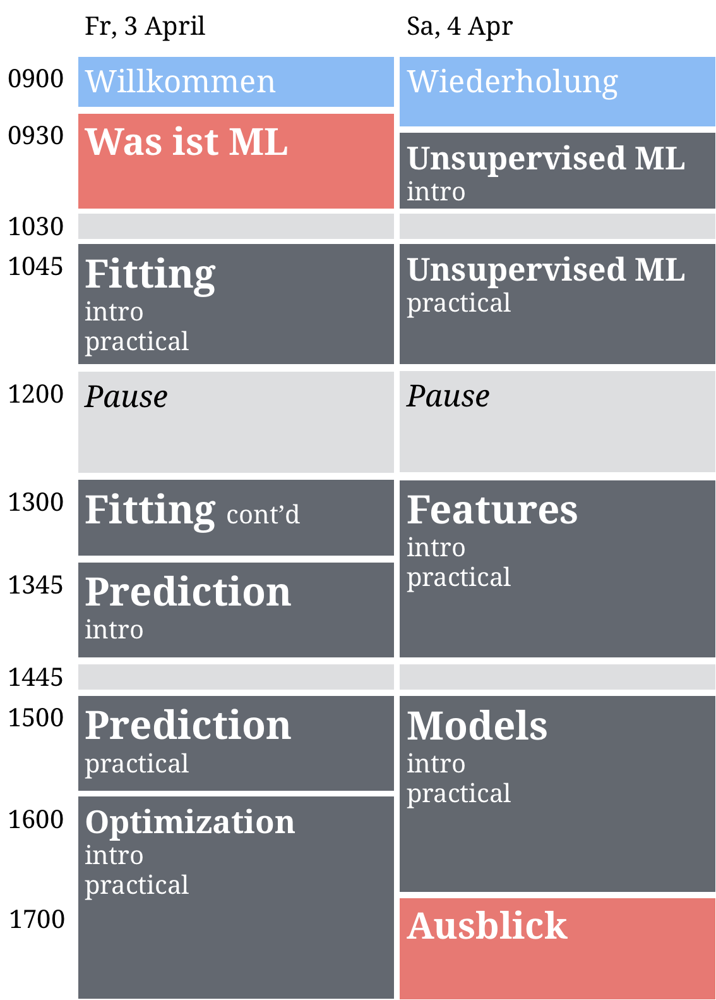

 

### Wifi

##### [**Instructions**](https://raw.githubusercontent.com/therbootcamp/therbootcamp.github.io/master/_sessions/_image/wifi_instruct.png)

### Downloads

##### [**Data sets**](https://www.dropbox.com/s/v7s5kesbc10fcvq/baselrbootcamp_MLdata.zip?dl=1)

##### [**PDFs**](https://www.dropbox.com/s/s2jy38nhmg8hsx1/MLwR2019May_pdfs.zip?dl=1)

 

### Materials

|  | Day 1 Basics| Day 2 Advanced| 
|:--|:-------------|:-------------|
|0| Welcome! [slides](_sessions/Welcome/Welcome.html) | Recap [slides](_sessions/Recap/Recap.html)|
|1| What is ML? [slides](_sessions/WhatIsML/WhatIsML.html)| Optimization [slides](_sessions/Optimization/Optimization.html), [practical](_sessions/Optimization/Optimization_practical.html)|
|2| R for ML  [slides](_sessions/RforML/RforML.html), [interactive](_sessions/RforML/RforML_interactive.R) | Features [slides](_sessions/Features/Features.html), [practical](_sessions/Features/Features_practical.html)|
|3| Fitting [slides](_sessions/Fitting/Fitting.html), [practical](_sessions/Fitting/Fitting_practical.html) | Models [slides](_sessions/Models/Models.html), [practical](_sessions/Models/Models_practical.html)|
|4|Prediction  [slides](_sessions/Prediction/Prediction.html), [practical](_sessions/Prediction/Prediction_practical.html) | Look ahead  [slides](_sessions/LookAhead/LookAhead.html)|

 

### Schedule

 
    </a> 

<!---

<table cellspacing=0 cellpadding=0 margin=0 padding=0 class="my-table">

<col width="10%">
<col width="40%">
<col width="40%">

<tr>
  <th style="text-align:left"> &nbsp; </th>
  <th style="text-align:left">Day 1 - Basic</th>
  <th style="text-align:left">Day 2 - Advanced</th>
</tr>
  
<tr>  
   <th>9:00</th>
   <td class="td-special-blue">Welcome</td>
   <td class="td-special-blue">Recap</td>
</tr>

<tr>
  <th>9:30</th>
  <td class="td-red" rowspan = 1><e>What is ML</e></td>
  <td class="td-grey" rowspan = 5><e>Optimization</e> 
    Practical
  </td>
</tr>
 
<tr>
  <th>10:00</th>
  <td class="td-red" rowspan=4><e>R for ML</e> 
    Interactive 
  </td>
  <td> &nbsp; </td>
</tr>
  
<tr> <th>&nbsp;</th> </tr>
<tr> <th>&nbsp;</th> </tr>
<tr> <th>&nbsp;</th> </tr>
  
<tr>
  <th align="right">12:00</th>
  <td rowspan = 2 class="td-special-grey">Lunch
  <td rowspan = 2 class="td-special-grey">Lunch
</tr>

<tr>
   <th>&nbsp;</th>
</tr>

<tr>
   <th align="right">13:00</th>
   <td class="td-grey" rowspan = 5 ><e>Fitting</e> 
   Practical 
   <td class="td-grey" rowspan = 5 ><e>Models</e> 
   Practical 
</tr>

<tr> <th>&nbsp;</th> </tr>
<tr> <th>&nbsp;</th> </tr>
<tr> <th>&nbsp;</th> </tr>
<tr> <th>&nbsp;</th> </tr>

<tr>
   <th align="right">15:30</th>
   <td class="td-grey" rowspan = 5 ><e>Prediction</e> 
   Practical 
   <td class="td-grey" rowspan = 4 ><e>Features</e> 
</tr>

<tr> <th align="right">&nbsp;</th> </tr>
<tr> <th align="right">&nbsp;</th> </tr>
<tr> <th align="right">&nbsp;</th> </tr>

<tr>
   <th align="right">17:30</th>
   <td class="td-red" valign="top"><e>Looking forward</e>
</tr>

<tr>
   <th align="right">18:00</th>
   <td class="td-special-blue"> Wrap-up
   <td class="td-special-grey"> Apero</tr>
</tr>
</table>
  
--->

